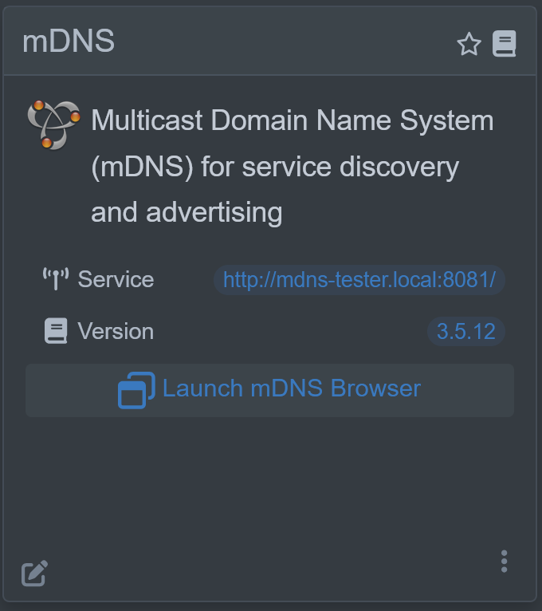

<div align="center">


# Quarkus mDNS
</div>
<br>

[](https://search.maven.org/artifact/io.quarkiverse.mdns/quarkus-mdns)
[](https://opensource.org/licenses/Apache-2.0)
[](https://github.com/quarkiverse/quarkus-mdns/actions/workflows/build.yml)

A Quarkus extension allowing use of Multicast DNS or `mDNS` to expose service advertisement as well as discover other services on your network. It is based on the [JmDNS](https://github.com/jmdns/jmdns) libary.

mDNS is sometimes also called ZeroConf/Bonjour/Avahi/Rendezvous and can work in conjunction with DNS Service Discovery (DNS-SD), a companion zero-configuration networking technique specified separately in RFC 6763.

> [!NOTE]  
> Quarkus mDNS is an ideal companion if you are writing an IoT (Internet of Things) application as many IoT devices use mDNS for service discovery and advertising.

## Getting started

Read the full [mDNS documentation](https://docs.quarkiverse.io/quarkus-mdns/dev/index.html).

### Installation

Create a new mdns project (with a base mdns starter code):

- With [code.quarkus.io](https://code.quarkus.io/?a=mdns-bowl&j=17&e=io.quarkiverse.mdns%3Aquarkus-mdns)
- With the [Quarkus CLI](https://quarkus.io/guides/cli-tooling):

```bash
quarkus create app mdns-app -x=io.quarkiverse.mdns:quarkus-mdns
```
Or add to you pom.xml directly:

```xml
<dependency>
    <groupId>io.quarkiverse.mdns</groupId>
    <artifactId>quarkus-mdns</artifactId>
    <version>{project-version}</version>
</dependency>
```

## Service Advertisement

`mDNS` by default will advertise your Quarkus server for HTTP discovery.

```properties
quarkus.http.host=0.0.0.0
quarkus.http.port=8081
quarkus.application.name=integration
```

Will expose your server on mDNS as `http://integration.local:8081` as an HTTP service type `_http._tcp.local.`.

> [!IMPORTANT]  
> `quarkus.http.host` must be set to `0.0.0.0` for the local URL `http://integration.local:8081` to work properly.  In dev/test mode this defaults to `localhost` which means the mDNS URL will not work.

Or you can inject it manually and expose any service you like. For example, this would expose it as supporting Apple TouchRemote.

```java
@Inject
JmDNS jmdns;

public void advertise() {
    Map<String, String> props = new HashMap<>();
    props.put("DvNm", "Quarkus Client");
    props.put("RemV", "10000");
    props.put("DvTy", "iPod");
    props.put("RemN", "Remote");
    props.put("txtvers", "1");
    ServiceInfo serviceInfo = ServiceInfo.create("_touch-remote._tcp", hostName, 1024, 0, 0, props);
    jmdns.registerService(serviceInfo);
}
```



## Service Discovery

You may also use `mDNS` to discover other services on your network by using the injectable component.  For example if you wanted to discover all the Apple Airport devices on your local network.

```java
@Inject
JmDNS jmdns;

public void listServices() {
    ServiceInfo[] infos = jmdns.list("_airport._tcp.local.");
    for (ServiceInfo info : infos) {
        System.out.println(info);
    }
}
```

## 🧑‍💻 Contributing

- Contribution is the best way to support and get involved in community!
- Please, consult our [Code of Conduct](./CODE_OF_CONDUCT.md) policies for interacting in our community.
- Contributions to `quarkus-mdns` Please check our [CONTRIBUTING.md](./CONTRIBUTING.md)

### If you have any idea or question 🤷

- [Ask a question](https://github.com/quarkiverse/quarkus-mdns/discussions)
- [Raise an issue](https://github.com/quarkiverse/quarkus-mdns/issues)
- [Feature request](https://github.com/quarkiverse/quarkus-mdns/issues)
- [Code submission](https://github.com/quarkiverse/quarkus-mdns/pulls)
## Contributors ✨

Thanks goes to these wonderful people ([emoji key](https://allcontributors.org/docs/en/emoji-key)):

<!-- ALL-CONTRIBUTORS-LIST:START - Do not remove or modify this section -->
<!-- prettier-ignore-start -->
<!-- markdownlint-disable -->
<table>
  <tbody>
    <tr>
      <td align="center" valign="top" width="14.28%"><a href="https://melloware.com"><br /><sub><b>Melloware</b></sub></a><br /><a href="#maintenance-melloware" title="Maintenance">🚧</a></td>
      <td align="center" valign="top" width="14.28%"><a href="https://fbricon.github.io/"><br /><sub><b>Fred Bricon</b></sub></a><br /><a href="#ideas-fbricon" title="Ideas, Planning, & Feedback">🤔</a> <a href="https://github.com/quarkiverse/quarkus-mdns/commits?author=fbricon" title="Code">💻</a></td>
      <td align="center" valign="top" width="14.28%"><a href="https://xam.dk"><br /><sub><b>Max Rydahl Andersen</b></sub></a><br /><a href="#ideas-maxandersen" title="Ideas, Planning, & Feedback">🤔</a></td>
      <td align="center" valign="top" width="14.28%"><a href="https://hollycummins.com"><br /><sub><b>Holly Cummins</b></sub></a><br /><a href="https://github.com/quarkiverse/quarkus-mdns/commits?author=holly-cummins" title="Documentation">📖</a></td>
    </tr>
  </tbody>
</table>

<!-- markdownlint-restore -->
<!-- prettier-ignore-end -->

<!-- ALL-CONTRIBUTORS-LIST:END -->

This project follows the [all-contributors](https://github.com/all-contributors/all-contributors) specification. Contributions of any kind welcome!
